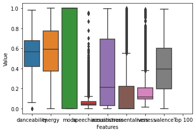

# Introduction

#### The all too common question: What's your type? 
#### Whether it's food, clothing, or even just what song to play next, I'm frequently aksed to define my "type". The "type" of clothes I like, or music tracks I enjoy, are often not easily compartmentalized into binary like/don't like categories. Digging into my personal Spotify listening data, however, may reveal common characteristics and traits about the music I most listen to. From this analysis, I may be able to discover the type of music I like isn't all that complicated.

## Research Questions: 
### - Using training data from my personal spotify listening history in 2020, can I accurately classify whether or not songs are in my top 100 songs of the year?
### - Using this model, can I recommend new favorite songs? 

## Data Request
----
####  Under the privacy settings on my Spotify profile, I requested 365 days worth of my personal listening history. The data from Spotify comes in a zip file with multiple json files. For the sake of this analysis, I made use the of the "StreamingHistory.json" files - each containing four columns: artist name, song name, date played, and milliseconds streamed.

#### More information on spotify data requests can be seen here: https://support.spotify.com/us/article/data-rights-and-privacy-settings/.


## Using the Spotify API to pull song characteristics
### Using the python package "spotipy" to interact with the Spotify API, I pulled audio characteristics for each track in my listening history. 
---
#### First, I imported python libraries and initalized a token for interacting with the spotify api.


```python
import spotipy
import sys
from spotipy.oauth2 import SpotifyClientCredentials
from spotipy.oauth2 import SpotifyOAuth
```


```python
import numpy as np 
import pandas as pd # for working with dataframes
import seaborn as sns # for data visualization 
import json
```

# Initialize Spotify Token

#### The information needed to access the api token is available here: https://developer.spotify.com/dashboard/login. Notice the redirect_uri is set to localhost because I'm not tying the api to a webpage.


```python
import spotipy.util as util

username = 'blank'
client_id ='blank'   
client_secret = 'blank' 
redirect_uri = 'http://localhost:7777/callback'
scope = 'user-read-recently-played'

token = util.prompt_for_user_token(username=username, 
                                   scope=scope, 
                                   client_id=client_id,   
                                   client_secret=client_secret,     
                                   redirect_uri=redirect_uri)
```

#### Next, I combined the tracks from the json files sent to me by Spotify. Using custom functions, I called the API for the track ids and audio features for the unique entries in the year of listening data. After combining the audio features with the data sent from spotify, I exported the combined data to a csv file to make for easier processing. 
#### For the sake of privacy, I've chosen to keep the data and code used for the step of out of this repository. 
##### If you're interested in a more detailed explanation for this process, see this medium article: https://towardsdatascience.com/get-your-spotify-streaming-history-with-python-d5a208bbcbd3

## Dataframe with unique songs from 2020


```python
twenty_twenty = pd.read_csv("project_streaming_history.csv")
```

## Exploratory Data Analysis


```python
# Take a look at the cleaned dataset
print(twenty_twenty.head(5))
twenty_twenty.info()
twenty_twenty.describe()
```

       Unnamed: 0                                    name  danceability   energy  \
    0           0                                  Fallen         0.703  0.68900   
    1           1                        Lifted Up (1985)         0.568  0.81600   
    2           2                          Rose Of Sharon         0.671  0.55100   
    3           3  Suite Bergamasque, L 75: Clair de lune         0.339  0.00597   
    4           4                         Redeemer (Live)         0.508  0.42600   
    
       key  loudness  mode  speechiness  acousticness  instrumentalness  ...  \
    0    8    -7.601     0       0.0472         0.722          0.000005  ...   
    1    0    -3.928     1       0.0281         0.014          0.000231  ...   
    2    2    -9.843     1       0.0363         0.334          0.007910  ...   
    3    3   -27.888     0       0.0509         0.994          0.926000  ...   
    4    7    -9.064     1       0.0357         0.313          0.000000  ...   
    
       valence    tempo            type                      id  \
    0   0.3870   95.024  audio_features  6bAkH8HzpunOxhjOtSCatE   
    1   0.3100  125.033  audio_features  0WjvB0SzNvgmuM46UjcMr8   
    2   0.4580  139.981  audio_features  6QGb8pyepToNZDcZcTM6or   
    3   0.0353  102.801  audio_features  3aOT5GxCXzMTJU6UPrip6T   
    4   0.2750  105.916  audio_features  7AvBKv58YrkEoCv6w3azHW   
    
                                        uri  \
    0  spotify:track:6bAkH8HzpunOxhjOtSCatE   
    1  spotify:track:0WjvB0SzNvgmuM46UjcMr8   
    2  spotify:track:6QGb8pyepToNZDcZcTM6or   
    3  spotify:track:3aOT5GxCXzMTJU6UPrip6T   
    4  spotify:track:7AvBKv58YrkEoCv6w3azHW   
    
                                              track_href  \
    0  https://api.spotify.com/v1/tracks/6bAkH8HzpunO...   
    1  https://api.spotify.com/v1/tracks/0WjvB0SzNvgm...   
    2  https://api.spotify.com/v1/tracks/6QGb8pyepToN...   
    3  https://api.spotify.com/v1/tracks/3aOT5GxCXzMT...   
    4  https://api.spotify.com/v1/tracks/7AvBKv58YrkE...   
    
                                            analysis_url duration_ms  \
    0  https://api.spotify.com/v1/audio-analysis/6bAk...      204579   
    1  https://api.spotify.com/v1/audio-analysis/0Wjv...      263293   
    2  https://api.spotify.com/v1/audio-analysis/6QGb...      203701   
    3  https://api.spotify.com/v1/audio-analysis/3aOT...      346347   
    4  https://api.spotify.com/v1/audio-analysis/7AvB...      344053   
    
       time_signature  Top 100  
    0               4      NaN  
    1               5      NaN  
    2               4      NaN  
    3               4      NaN  
    4               4      NaN  
    
    [5 rows x 21 columns]
    <class 'pandas.core.frame.DataFrame'>
    RangeIndex: 4130 entries, 0 to 4129
    Data columns (total 21 columns):
     #   Column            Non-Null Count  Dtype  
    ---  ------            --------------  -----  
     0   Unnamed: 0        4130 non-null   int64  
     1   name              4130 non-null   object 
     2   danceability      4130 non-null   float64
     3   energy            4130 non-null   float64
     4   key               4130 non-null   int64  
     5   loudness          4130 non-null   float64
     6   mode              4130 non-null   int64  
     7   speechiness       4130 non-null   float64
     8   acousticness      4130 non-null   float64
     9   instrumentalness  4130 non-null   float64
     10  liveness          4130 non-null   float64
     11  valence           4130 non-null   float64
     12  tempo             4130 non-null   float64
     13  type              4130 non-null   object 
     14  id                4130 non-null   object 
     15  uri               4130 non-null   object 
     16  track_href        4130 non-null   object 
     17  analysis_url      4130 non-null   object 
     18  duration_ms       4130 non-null   int64  
     19  time_signature    4130 non-null   int64  
     20  Top 100           0 non-null      float64
    dtypes: float64(10), int64(5), object(6)
    memory usage: 677.7+ KB
    


<div>
<style scoped>
    .dataframe tbody tr th:only-of-type {
        vertical-align: middle;
    }

    .dataframe tbody tr th {
        vertical-align: top;
    }

    .dataframe thead th {
        text-align: right;
    }
</style>
<table border="1" class="dataframe">
  <thead>
    <tr style="text-align: right;">
      <th></th>
      <th>Unnamed: 0</th>
      <th>danceability</th>
      <th>energy</th>
      <th>key</th>
      <th>loudness</th>
      <th>mode</th>
      <th>speechiness</th>
      <th>acousticness</th>
      <th>instrumentalness</th>
      <th>liveness</th>
      <th>valence</th>
      <th>tempo</th>
      <th>duration_ms</th>
      <th>time_signature</th>
      <th>Top 100</th>
    </tr>
  </thead>
  <tbody>
    <tr>
      <th>count</th>
      <td>4130.000000</td>
      <td>4130.000000</td>
      <td>4130.000000</td>
      <td>4130.000000</td>
      <td>4130.000000</td>
      <td>4130.000000</td>
      <td>4130.000000</td>
      <td>4130.000000</td>
      <td>4130.000000</td>
      <td>4130.000000</td>
      <td>4130.000000</td>
      <td>4130.000000</td>
      <td>4.130000e+03</td>
      <td>4130.000000</td>
      <td>0.0</td>
    </tr>
    <tr>
      <th>mean</th>
      <td>2064.500000</td>
      <td>0.543127</td>
      <td>0.558329</td>
      <td>5.158838</td>
      <td>-9.537065</td>
      <td>0.689588</td>
      <td>0.073176</td>
      <td>0.355635</td>
      <td>0.196132</td>
      <td>0.180066</td>
      <td>0.413630</td>
      <td>117.574991</td>
      <td>2.302641e+05</td>
      <td>3.888378</td>
      <td>NaN</td>
    </tr>
    <tr>
      <th>std</th>
      <td>1192.372635</td>
      <td>0.191815</td>
      <td>0.258877</td>
      <td>3.571632</td>
      <td>5.927888</td>
      <td>0.462718</td>
      <td>0.081533</td>
      <td>0.353288</td>
      <td>0.339621</td>
      <td>0.153287</td>
      <td>0.252714</td>
      <td>29.046462</td>
      <td>7.939023e+04</td>
      <td>0.448226</td>
      <td>NaN</td>
    </tr>
    <tr>
      <th>min</th>
      <td>0.000000</td>
      <td>0.000000</td>
      <td>0.000020</td>
      <td>0.000000</td>
      <td>-46.847000</td>
      <td>0.000000</td>
      <td>0.000000</td>
      <td>0.000002</td>
      <td>0.000000</td>
      <td>0.015000</td>
      <td>0.000000</td>
      <td>0.000000</td>
      <td>3.026900e+04</td>
      <td>0.000000</td>
      <td>NaN</td>
    </tr>
    <tr>
      <th>25%</th>
      <td>1032.250000</td>
      <td>0.421250</td>
      <td>0.372000</td>
      <td>2.000000</td>
      <td>-11.599750</td>
      <td>0.000000</td>
      <td>0.034600</td>
      <td>0.030250</td>
      <td>0.000000</td>
      <td>0.095000</td>
      <td>0.197250</td>
      <td>95.003000</td>
      <td>1.859470e+05</td>
      <td>4.000000</td>
      <td>NaN</td>
    </tr>
    <tr>
      <th>50%</th>
      <td>2064.500000</td>
      <td>0.564000</td>
      <td>0.592000</td>
      <td>5.000000</td>
      <td>-7.841000</td>
      <td>1.000000</td>
      <td>0.043400</td>
      <td>0.210000</td>
      <td>0.000338</td>
      <td>0.117000</td>
      <td>0.393500</td>
      <td>118.131000</td>
      <td>2.187465e+05</td>
      <td>4.000000</td>
      <td>NaN</td>
    </tr>
    <tr>
      <th>75%</th>
      <td>3096.750000</td>
      <td>0.679000</td>
      <td>0.773000</td>
      <td>8.000000</td>
      <td>-5.593250</td>
      <td>1.000000</td>
      <td>0.070100</td>
      <td>0.695000</td>
      <td>0.220000</td>
      <td>0.208000</td>
      <td>0.601000</td>
      <td>135.043500</td>
      <td>2.585088e+05</td>
      <td>4.000000</td>
      <td>NaN</td>
    </tr>
    <tr>
      <th>max</th>
      <td>4129.000000</td>
      <td>0.980000</td>
      <td>1.000000</td>
      <td>11.000000</td>
      <td>1.342000</td>
      <td>1.000000</td>
      <td>0.955000</td>
      <td>0.996000</td>
      <td>0.999000</td>
      <td>0.992000</td>
      <td>0.990000</td>
      <td>216.020000</td>
      <td>1.003747e+06</td>
      <td>5.000000</td>
      <td>NaN</td>
    </tr>
  </tbody>
</table>
</div>


# Get My Personal Top 100 Songs for 2020 - Spotify Wrapped

#### Spotify creates a playlist, "Spotify Wrapped", of your top 100 songs each December. I called the Spotify API below to get the track ids and names from this playlist


```python
sp = spotipy.Spotify(auth=token)
playlist = sp.user_playlist(username, "37i9dQZF1ELW7shatv3Mfk") 
songs = playlist["tracks"]["items"] 
ids = [] 
song_id = []
for i in range(len(songs)): 
    ids.append(songs[i]["track"]["id"]) 
    song_id.append(songs[i]["track"]["name"])
features = sp.audio_features(ids) 
top_one_hundred = pd.DataFrame(features)
top_one_hundred ["name"] = song_id
```


```python
print(top_one_hundred.head(5))
top_one_hundred.info()
top_one_hundred.describe()
```

       danceability  energy  key  loudness  mode  speechiness  acousticness  \
    0         0.541   0.695    2    -7.750     1       0.0456       0.01480   
    1         0.686   0.979    7    -3.356     1       0.0827       0.12600   
    2         0.582   0.821    0    -4.861     1       0.0365       0.00754   
    3         0.357   0.434    0   -11.521     1       0.0418       0.24400   
    4         0.362   0.377    2    -9.713     1       0.0339       0.73200   
    
       instrumentalness  liveness  valence    tempo            type  \
    0          0.000114    0.1370   0.3180  115.122  audio_features   
    1          0.926000    0.4980   0.7010  124.969  audio_features   
    2          0.000002    0.8180   0.4680  100.025  audio_features   
    3          0.006540    0.0808   0.0907  145.743  audio_features   
    4          0.000631    0.1270   0.2940  137.891  audio_features   
    
                           id                                   uri  \
    0  1AnoNTlYCt1ELWArtKsA4s  spotify:track:1AnoNTlYCt1ELWArtKsA4s   
    1  4D85hPo0SE9eBSq7GCtXs9  spotify:track:4D85hPo0SE9eBSq7GCtXs9   
    2  0iQ77tSa7ncj7zBPtVx6cU  spotify:track:0iQ77tSa7ncj7zBPtVx6cU   
    3  4B4kunXhV2ZKnYcvDgAFoE  spotify:track:4B4kunXhV2ZKnYcvDgAFoE   
    4  7cK7hDrE7vAesPf8xd5zmb  spotify:track:7cK7hDrE7vAesPf8xd5zmb   
    
                                              track_href  \
    0  https://api.spotify.com/v1/tracks/1AnoNTlYCt1E...   
    1  https://api.spotify.com/v1/tracks/4D85hPo0SE9e...   
    2  https://api.spotify.com/v1/tracks/0iQ77tSa7ncj...   
    3  https://api.spotify.com/v1/tracks/4B4kunXhV2ZK...   
    4  https://api.spotify.com/v1/tracks/7cK7hDrE7vAe...   
    
                                            analysis_url  duration_ms  \
    0  https://api.spotify.com/v1/audio-analysis/1Ano...       211109   
    1  https://api.spotify.com/v1/audio-analysis/4D85...       180480   
    2  https://api.spotify.com/v1/audio-analysis/0iQ7...       261373   
    3  https://api.spotify.com/v1/audio-analysis/4B4k...       257907   
    4  https://api.spotify.com/v1/audio-analysis/7cK7...       178176   
    
       time_signature                name  
    0               4  My Thoughts on You  
    1               4                CRZY  
    2               4            One Foot  
    3               4                 5AM  
    4               4         Stupid Deep  
    <class 'pandas.core.frame.DataFrame'>
    RangeIndex: 100 entries, 0 to 99
    Data columns (total 19 columns):
     #   Column            Non-Null Count  Dtype  
    ---  ------            --------------  -----  
     0   danceability      100 non-null    float64
     1   energy            100 non-null    float64
     2   key               100 non-null    int64  
     3   loudness          100 non-null    float64
     4   mode              100 non-null    int64  
     5   speechiness       100 non-null    float64
     6   acousticness      100 non-null    float64
     7   instrumentalness  100 non-null    float64
     8   liveness          100 non-null    float64
     9   valence           100 non-null    float64
     10  tempo             100 non-null    float64
     11  type              100 non-null    object 
     12  id                100 non-null    object 
     13  uri               100 non-null    object 
     14  track_href        100 non-null    object 
     15  analysis_url      100 non-null    object 
     16  duration_ms       100 non-null    int64  
     17  time_signature    100 non-null    int64  
     18  name              100 non-null    object 
    dtypes: float64(9), int64(4), object(6)
    memory usage: 15.0+ KB
    


<div>
<style scoped>
    .dataframe tbody tr th:only-of-type {
        vertical-align: middle;
    }

    .dataframe tbody tr th {
        vertical-align: top;
    }

    .dataframe thead th {
        text-align: right;
    }
</style>
<table border="1" class="dataframe">
  <thead>
    <tr style="text-align: right;">
      <th></th>
      <th>danceability</th>
      <th>energy</th>
      <th>key</th>
      <th>loudness</th>
      <th>mode</th>
      <th>speechiness</th>
      <th>acousticness</th>
      <th>instrumentalness</th>
      <th>liveness</th>
      <th>valence</th>
      <th>tempo</th>
      <th>duration_ms</th>
      <th>time_signature</th>
    </tr>
  </thead>
  <tbody>
    <tr>
      <th>count</th>
      <td>100.000000</td>
      <td>100.000000</td>
      <td>100.000000</td>
      <td>100.000000</td>
      <td>100.000000</td>
      <td>100.000000</td>
      <td>100.000000</td>
      <td>100.000000</td>
      <td>100.000000</td>
      <td>100.000000</td>
      <td>100.000000</td>
      <td>100.000000</td>
      <td>100.000000</td>
    </tr>
    <tr>
      <th>mean</th>
      <td>0.510720</td>
      <td>0.562116</td>
      <td>4.750000</td>
      <td>-9.187930</td>
      <td>0.740000</td>
      <td>0.061654</td>
      <td>0.390641</td>
      <td>0.216205</td>
      <td>0.167459</td>
      <td>0.350285</td>
      <td>115.498310</td>
      <td>239992.340000</td>
      <td>3.850000</td>
    </tr>
    <tr>
      <th>std</th>
      <td>0.190586</td>
      <td>0.295993</td>
      <td>3.785605</td>
      <td>6.306964</td>
      <td>0.440844</td>
      <td>0.062758</td>
      <td>0.388094</td>
      <td>0.339844</td>
      <td>0.156092</td>
      <td>0.230231</td>
      <td>27.839705</td>
      <td>60132.388931</td>
      <td>0.538891</td>
    </tr>
    <tr>
      <th>min</th>
      <td>0.113000</td>
      <td>0.016100</td>
      <td>0.000000</td>
      <td>-31.034000</td>
      <td>0.000000</td>
      <td>0.027800</td>
      <td>0.000351</td>
      <td>0.000000</td>
      <td>0.027600</td>
      <td>0.035000</td>
      <td>46.755000</td>
      <td>82773.000000</td>
      <td>1.000000</td>
    </tr>
    <tr>
      <th>25%</th>
      <td>0.367000</td>
      <td>0.320250</td>
      <td>1.000000</td>
      <td>-11.565750</td>
      <td>0.000000</td>
      <td>0.035425</td>
      <td>0.024350</td>
      <td>0.000006</td>
      <td>0.091200</td>
      <td>0.151750</td>
      <td>97.730500</td>
      <td>195575.750000</td>
      <td>4.000000</td>
    </tr>
    <tr>
      <th>50%</th>
      <td>0.529000</td>
      <td>0.643500</td>
      <td>4.000000</td>
      <td>-7.133500</td>
      <td>1.000000</td>
      <td>0.040550</td>
      <td>0.223000</td>
      <td>0.007460</td>
      <td>0.109000</td>
      <td>0.310500</td>
      <td>116.592500</td>
      <td>232903.000000</td>
      <td>4.000000</td>
    </tr>
    <tr>
      <th>75%</th>
      <td>0.660250</td>
      <td>0.814250</td>
      <td>8.000000</td>
      <td>-4.947250</td>
      <td>1.000000</td>
      <td>0.058200</td>
      <td>0.865500</td>
      <td>0.387500</td>
      <td>0.160000</td>
      <td>0.538250</td>
      <td>128.694000</td>
      <td>276973.750000</td>
      <td>4.000000</td>
    </tr>
    <tr>
      <th>max</th>
      <td>0.885000</td>
      <td>0.995000</td>
      <td>11.000000</td>
      <td>-0.908000</td>
      <td>1.000000</td>
      <td>0.463000</td>
      <td>0.994000</td>
      <td>0.981000</td>
      <td>0.955000</td>
      <td>0.954000</td>
      <td>191.898000</td>
      <td>402565.000000</td>
      <td>5.000000</td>
    </tr>
  </tbody>
</table>
</div>


```python
# Create Response variable (in/out of top 100 playlist)
twenty_twenty['top_100'] = twenty_twenty['name'].isin(top_one_hundred['name'])
```


```python
# Plot boxplot (variables only)
import matplotlib.pyplot as plt
sns.boxplot(data=twenty_twenty.drop(['Unnamed: 0', 'name', 'key','track_href','analysis_url','uri','id','type','duration_ms','tempo','loudness','time_signature','top_100'], axis=1))
plt.xlabel('Features')
plt.ylabel('Value')
plt.show()
```


    

    


### Audio Features According to Spotify's Developer Tools Site 
###### duration_ms -	integer	- The duration of the track in milliseconds.
###### key - integer	- The estimated overall key of the track. Integers map to pitches using standard Pitch Class notation . E.g. 0 = C, 1 = C♯/D♭, 2 = D, and so on. If no key was detected, the value is -1.
######  mode - integer -	Mode indicates the modality (major or minor) of a track, the type of scale from which its melodic content is derived. Major is represented by 1 and minor is 0.
###### time_signature - integer	- An estimated overall time signature of a track. The time signature (meter) is a notational convention to specify how many beats are in each bar (or measure).
###### acousticness -	float -	A confidence measure from 0.0 to 1.0 of whether the track is acoustic. 1.0 represents high confidence the track is acoustic. 
###### danceability	float	Danceability describes how suitable a track is for dancing based on a combination of musical elements including tempo, rhythm stability, beat strength, and overall regularity. A value of 0.0 is least danceable and 1.0 is most danceable. 
###### energy -	float -	Energy is a measure from 0.0 to 1.0 and represents a perceptual measure of intensity and activity. 
###### instrumentalness -	float -	Predicts whether a track contains no vocals. “Ooh” and “aah” sounds are treated as instrumental in this context. Rap or spoken word tracks are clearly “vocal”. The closer the instrumentalness value is to 1.0, the greater likelihood the track contains no vocal content. Values above 0.5 are intended to represent instrumental tracks, but confidence is higher as the value approaches 1.0. 
###### liveness -	float -	Detects the presence of an audience in the recording. Higher liveness values represent an increased probability that the track was performed live. A value above 0.8 provides strong likelihood that the track is live. 
###### loudness -	float -	The overall loudness of a track in decibels (dB). Loudness values are averaged across the entire track and are useful for comparing relative loudness of tracks. Loudness is the quality of a sound that is the primary psychological correlate of physical strength (amplitude). Values typical range between -60 and 0 db. 
###### speechiness -	float -	Speechiness detects the presence of spoken words in a track. The more exclusively speech-like the recording (e.g. talk show, audio book, poetry), the closer to 1.0 the attribute value. Values above 0.66 describe tracks that are probably made entirely of spoken words. Values between 0.33 and 0.66 describe tracks that may contain both music and speech, either in sections or layered, including such cases as rap music. Values below 0.33 most likely represent music and other non-speech-like tracks. 
###### valence	- float -	A measure from 0.0 to 1.0 describing the musical positiveness conveyed by a track. Tracks with high valence sound more positive (e.g. happy, cheerful, euphoric), while tracks with low valence sound more negative (e.g. sad, depressed, angry). 
###### tempo - float -	The overall estimated tempo of a track in beats per minute (BPM). In musical terminology, tempo is the speed or pace of a given piece and derives directly from the average beat duration. 
###### id	string -	The Spotify ID for the track.
###### uri	string -	The Spotify URI for the track.
###### track_href -	string	A link to the Web API endpoint providing full details of the track.
###### analysis_url	string -	An HTTP URL to access the full audio analysis of this track. An access token is required to access this data.
###### type	string -	The object type: “audio_features”

### Pair plot for personal listening history (top 100 tracks in orange)


```python
sns.pairplot(data=twenty_twenty.drop(['Unnamed: 0', 'name', 'track_href','analysis_url','uri','id','type','time_signature'], axis=1),hue='top_100')
plt.show()
```


    

    


### Pair plot for Top 100 Tracks


```python
sns.pairplot(data=top_one_hundred.drop(['track_href'], axis=1))
plt.show()
```


    

    


### Correlation matrix for personal listening history 
----
#### The line in this matrix that is most significant to me is the last line that shows the coorelation between each covariate and the top_100 classification. It is clear that none of the factors on there own are highly coorelated with top 100 classification.


```python
fig, ax = plt.subplots(figsize=(15,10))
sns.heatmap(twenty_twenty.corr(), annot=True, cmap='YlGnBu', vmin=-1, vmax=1, center=0, ax=ax)
plt.title('Personal Listening History: Linear Correlation Matrix')
plt.show()
```


    

    


### Correlation matrix for top 100 tracks
----
#### one major difference between the coorrelation matrix for all tracks in my 2020 listening history and only the songs in my top 100 are the coorelations between loudness, energy, and danceability. It appears that my top 100 has a greater representation of relationships between these characteristic, such as dance tracks, than the rest of my audio history for the year


```python
fig, ax = plt.subplots(figsize=(15,10))
sns.heatmap(top_one_hundred.corr(), annot=True, cmap='YlGnBu', vmin=-1, vmax=1, center=0, ax=ax)
plt.title('Top 100 Tracks: Linear Correlation Matrix')
plt.show()
```


    

    


## Model Fit


```python
#import sklearn and imblearn
from collections import Counter
from imblearn.datasets import fetch_datasets
from sklearn.model_selection import train_test_split
from sklearn.pipeline import make_pipeline
from imblearn.pipeline import make_pipeline as make_pipeline_imb
from imblearn.over_sampling import SMOTE
from imblearn.under_sampling import NearMiss
from imblearn.metrics import classification_report_imbalanced
from sklearn.metrics import precision_score, recall_score, f1_score, roc_auc_score, accuracy_score, classification_report
from sklearn.ensemble import RandomForestClassifier, GradientBoostingClassifier
import numpy as np
```


```python
#choose columns in dataset with covariates
X = twenty_twenty.iloc[:,[2,3,4,5,6,7,8,9,10,11,12,19]]
y = twenty_twenty['top_100'].astype(int)
```


```python
X
```


<div>
<style scoped>
    .dataframe tbody tr th:only-of-type {
        vertical-align: middle;
    }

    .dataframe tbody tr th {
        vertical-align: top;
    }

    .dataframe thead th {
        text-align: right;
    }
</style>
<table border="1" class="dataframe">
  <thead>
    <tr style="text-align: right;">
      <th></th>
      <th>danceability</th>
      <th>energy</th>
      <th>key</th>
      <th>loudness</th>
      <th>mode</th>
      <th>speechiness</th>
      <th>acousticness</th>
      <th>instrumentalness</th>
      <th>liveness</th>
      <th>valence</th>
      <th>tempo</th>
      <th>time_signature</th>
    </tr>
  </thead>
  <tbody>
    <tr>
      <th>0</th>
      <td>0.7030</td>
      <td>0.68900</td>
      <td>8</td>
      <td>-7.601</td>
      <td>0</td>
      <td>0.0472</td>
      <td>0.722</td>
      <td>0.000005</td>
      <td>0.3240</td>
      <td>0.3870</td>
      <td>95.024</td>
      <td>4</td>
    </tr>
    <tr>
      <th>1</th>
      <td>0.5680</td>
      <td>0.81600</td>
      <td>0</td>
      <td>-3.928</td>
      <td>1</td>
      <td>0.0281</td>
      <td>0.014</td>
      <td>0.000231</td>
      <td>0.1550</td>
      <td>0.3100</td>
      <td>125.033</td>
      <td>5</td>
    </tr>
    <tr>
      <th>2</th>
      <td>0.6710</td>
      <td>0.55100</td>
      <td>2</td>
      <td>-9.843</td>
      <td>1</td>
      <td>0.0363</td>
      <td>0.334</td>
      <td>0.007910</td>
      <td>0.0874</td>
      <td>0.4580</td>
      <td>139.981</td>
      <td>4</td>
    </tr>
    <tr>
      <th>3</th>
      <td>0.3390</td>
      <td>0.00597</td>
      <td>3</td>
      <td>-27.888</td>
      <td>0</td>
      <td>0.0509</td>
      <td>0.994</td>
      <td>0.926000</td>
      <td>0.0695</td>
      <td>0.0353</td>
      <td>102.801</td>
      <td>4</td>
    </tr>
    <tr>
      <th>4</th>
      <td>0.5080</td>
      <td>0.42600</td>
      <td>7</td>
      <td>-9.064</td>
      <td>1</td>
      <td>0.0357</td>
      <td>0.313</td>
      <td>0.000000</td>
      <td>0.9550</td>
      <td>0.2750</td>
      <td>105.916</td>
      <td>4</td>
    </tr>
    <tr>
      <th>...</th>
      <td>...</td>
      <td>...</td>
      <td>...</td>
      <td>...</td>
      <td>...</td>
      <td>...</td>
      <td>...</td>
      <td>...</td>
      <td>...</td>
      <td>...</td>
      <td>...</td>
      <td>...</td>
    </tr>
    <tr>
      <th>4125</th>
      <td>0.1650</td>
      <td>0.07470</td>
      <td>7</td>
      <td>-23.522</td>
      <td>1</td>
      <td>0.0382</td>
      <td>0.992</td>
      <td>0.739000</td>
      <td>0.1070</td>
      <td>0.0671</td>
      <td>130.419</td>
      <td>5</td>
    </tr>
    <tr>
      <th>4126</th>
      <td>0.0978</td>
      <td>0.22300</td>
      <td>7</td>
      <td>-15.884</td>
      <td>0</td>
      <td>0.0344</td>
      <td>0.530</td>
      <td>0.965000</td>
      <td>0.1070</td>
      <td>0.0400</td>
      <td>88.799</td>
      <td>3</td>
    </tr>
    <tr>
      <th>4127</th>
      <td>0.9220</td>
      <td>0.53500</td>
      <td>6</td>
      <td>-8.171</td>
      <td>0</td>
      <td>0.0484</td>
      <td>0.144</td>
      <td>0.271000</td>
      <td>0.5520</td>
      <td>0.3820</td>
      <td>123.972</td>
      <td>4</td>
    </tr>
    <tr>
      <th>4128</th>
      <td>0.3820</td>
      <td>0.54000</td>
      <td>4</td>
      <td>-8.768</td>
      <td>1</td>
      <td>0.0289</td>
      <td>0.908</td>
      <td>0.651000</td>
      <td>0.0915</td>
      <td>0.0948</td>
      <td>139.693</td>
      <td>3</td>
    </tr>
    <tr>
      <th>4129</th>
      <td>0.1120</td>
      <td>0.12200</td>
      <td>11</td>
      <td>-19.599</td>
      <td>1</td>
      <td>0.0421</td>
      <td>0.952</td>
      <td>0.000008</td>
      <td>0.1290</td>
      <td>0.0399</td>
      <td>171.604</td>
      <td>4</td>
    </tr>
  </tbody>
</table>
<p>4130 rows × 12 columns</p>
</div>


### Train/Test Split


```python
# splitting data into training and test set
X_train, X_test, y_train, y_test = train_test_split(X, twenty_twenty['top_100'],stratify=twenty_twenty['top_100'],test_size=0.33, random_state=2)
```


```python
#Turn response variable into integer
y_train = y_train.astype(int)
y_test = y_test.astype(int)
y_train.count
```


    <bound method Series.count of 3807    0
    1948    0
    2095    0
    976     0
    65      0
           ..
    1684    0
    2843    0
    2606    0
    1925    0
    2849    0
    Name: top_100, Length: 2767, dtype: int32>


## Random Forest Model 
#### - acts a baseline for comparing model performance

## Strengths
#### Random forest runtimes are quite fast, and they are able to deal with unbalanced and missing data. 
## Weaknesses
#### Random forest models are known to over-fit data sets that are particularly noisy.


```python
# function for model performance output
def print_results(headline, true_value, pred):
    print(headline)
    print("accuracy: {}".format(accuracy_score(true_value, pred)))
    print("precision: {}".format(precision_score(true_value, pred)))
    print("recall: {}".format(recall_score(true_value, pred)))
    print("f1: {}".format(f1_score(true_value, pred)))
```


```python
classifier = RandomForestClassifier
pipeline = make_pipeline(classifier(random_state=42))
model = pipeline.fit(X_train, y_train)
prediction = model.predict(X_test)
print('normal Pipeline Score {}'.format(pipeline.score(X_test, y_test)))
print()
print_results("normal classification", y_test, prediction)
print(classification_report(y_test, prediction))

print()

```

    
    normal Pipeline Score 0.9765223771093177
    normal classification
    accuracy: 0.9765223771093177
    precision: 0.0
    recall: 0.0
    f1: 0.0
                  precision    recall  f1-score   support
    
               0       0.98      1.00      0.99      1331
               1       0.00      0.00      0.00        32
    
        accuracy                           0.98      1363
       macro avg       0.49      0.50      0.49      1363
    weighted avg       0.95      0.98      0.96      1363
    
    
    

    C:\Users\austi\anaconda3\lib\site-packages\sklearn\metrics\_classification.py:1221: UndefinedMetricWarning: Precision is ill-defined and being set to 0.0 due to no predicted samples. Use `zero_division` parameter to control this behavior.
      _warn_prf(average, modifier, msg_start, len(result))
    C:\Users\austi\anaconda3\lib\site-packages\sklearn\metrics\_classification.py:1221: UndefinedMetricWarning: Precision and F-score are ill-defined and being set to 0.0 in labels with no predicted samples. Use `zero_division` parameter to control this behavior.
      _warn_prf(average, modifier, msg_start, len(result))
    

## Explanation of Model evaluation metrics used
---
#### - Accuracy is defined as the percentage of correct predictions for the test data. It can be calculated easily by dividing the number of correct predictions by the number of total predictions. The large class imbalance in this dataset makes the model particularly good at predicting the majority class correctly.
#### - Precision is defined as the fraction of relevant examples (true positives) among all of the examples which were predicted to belong in a certain class.
#### - Recall is defined as the fraction of examples which were predicted to belong to a class with respect to all of the examples that truly belong in the class.
#### - F-score is a way of combining the precision and recall of the model, and it is defined as the harmonic mean of the model's precision and recall.
---
### Testing a standard random forest model reveals the complexity of dealing with class imbalance datasets. The random forest model was not able to correctly classify any of the songs that make up the top 100 playlist. 


## Gradient Boosting
#### - Boosting is an algorithm that helps in reducing variance and bias in a machine learning ensemble.
#### - Gradient boosting utilizes the gradient descent to pinpoint the challenges in the learners’ predictions used previously


```python
boost_classifier = GradientBoostingClassifier
boost_pipeline = make_pipeline(boost_classifier(random_state=42))
boost_model = boost_pipeline.fit(X_train, y_train)
boost_prediction = boost_model.predict(X_test)

```


```python
print('normal Pipeline Score {}'.format(boost_pipeline.score(X_test, y_test)))
print()
print_results("normal classification", y_test, boost_prediction)
print(classification_report(y_test, boost_prediction))

print()
```

    normal Pipeline Score 0.9728539985326485
    
    normal classification
    accuracy: 0.9728539985326485
    precision: 0.0
    recall: 0.0
    f1: 0.0
                  precision    recall  f1-score   support
    
               0       0.98      1.00      0.99      1331
               1       0.00      0.00      0.00        32
    
        accuracy                           0.97      1363
       macro avg       0.49      0.50      0.49      1363
    weighted avg       0.95      0.97      0.96      1363
    
    
    

### Testing a gradient boosting model reveals the complexity of dealing with class imbalance datasets. The gradient boost model was also not able to correctly classify any of the songs that make up the top 100 playlist. 

## Steps used to improve model performance
---
#### Considering the class (in/out of top 100) imbalance, I have chosen to implement the SMOTE model and a nearmiss model. The SMOTE model oversamples the minority class, which in this case are the songs which land in the top 100, to generate synthetic samples


```python
# build random forest model with SMOTE imblearn (oversample the minority class)
smote_pipeline = make_pipeline_imb(SMOTE(random_state=4), classifier(random_state=42))
smote_model = smote_pipeline.fit(X_train, y_train)
smote_prediction = smote_model.predict(X_test)
```


```python
# See the balance of classes: in/out of top 100
print()

X_smote, y_smote = SMOTE().fit_sample(X_train, y_train)
print("SMOTE data distribution: {}".format(Counter(y_smote)))
```

    
    SMOTE data distribution: Counter({0: 2701, 1: 2701})
    


```python
# build gradient boosting model with SMOTE imblearn (oversample the minority class)
smote_pipeline_boost = make_pipeline_imb(SMOTE(random_state=4), boost_classifier(random_state=42))
smote_model_boost = smote_pipeline_boost.fit(X_train, y_train)
smote_prediction_boost = smote_model_boost.predict(X_test)
```


```python
# See the balance of classes: in/out of top 100
print()

X_smote, y_smote = SMOTE().fit_sample(X_train, y_train)
print("SMOTE data distribution: {}".format(Counter(y_smote)))
```

    
    SMOTE data distribution: Counter({0: 2701, 1: 2701})
    

#### The Near Miss model undersamples the majority class, which in this case are the songs that don't land in the top 100, to balance the data between the majority and minority classes.


```python
# build random forest model with undersampling
nearmiss_pipeline = make_pipeline_imb(NearMiss(), classifier(random_state=42))
nearmiss_model = nearmiss_pipeline.fit(X_train, y_train)
nearmiss_prediction = nearmiss_model.predict(X_test)
```


```python
# See the balance of classes: in/out of top 100
X_nearmiss, y_nearmiss = NearMiss().fit_sample(X_train, y_train)
print("NearMiss data distribution: {}".format(Counter(y_nearmiss)))
```

    NearMiss data distribution: Counter({0: 66, 1: 66})
    


```python
# build gradient boost model with undersampling
nearmiss_pipeline_boost = make_pipeline_imb(NearMiss(), boost_classifier(random_state=42))
nearmiss_model_boost = nearmiss_pipeline_boost.fit(X_train, y_train)
nearmiss_prediction_boost = nearmiss_model_boost.predict(X_test)
```


```python
# See the balance of classes: in/out of top 100
X_nearmiss, y_nearmiss = NearMiss().fit_sample(X_train, y_train)
print("NearMiss data distribution: {}".format(Counter(y_nearmiss)))
```

    NearMiss data distribution: Counter({0: 66, 1: 66})
    

## Model Performance


```python
# classification report
print("Random Forest Model", classification_report(y_test, prediction))
print("SMOTE Oversampling - Random Forest Model",classification_report_imbalanced(y_test, smote_prediction))
print("SMOTE Oversampling - Gradient Boost Model",classification_report_imbalanced(y_test, smote_prediction_boost))
print("Nearmiss Undersampling - Random Forest Model",classification_report_imbalanced(y_test, nearmiss_prediction))
print("Nearmiss Undersampling - Gradient Boost Model",classification_report_imbalanced(y_test, nearmiss_prediction_boost))
```

    Random Forest Model               precision    recall  f1-score   support
    
               0       0.98      1.00      0.99      1331
               1       0.00      0.00      0.00        32
    
        accuracy                           0.98      1363
       macro avg       0.49      0.50      0.49      1363
    weighted avg       0.95      0.98      0.96      1363
    
    SMOTE Oversampling - Random Forest Model                    pre       rec       spe        f1       geo       iba       sup
    
              0       0.98      0.97      0.06      0.97      0.25      0.07      1331
              1       0.05      0.06      0.97      0.06      0.25      0.06        32
    
    avg / total       0.96      0.95      0.08      0.95      0.25      0.07      1363
    
    SMOTE Oversampling - Gradient Boost Model                    pre       rec       spe        f1       geo       iba       sup
    
              0       0.98      0.84      0.12      0.90      0.32      0.11      1331
              1       0.02      0.12      0.84      0.03      0.32      0.10        32
    
    avg / total       0.95      0.83      0.14      0.88      0.32      0.11      1363
    
    Nearmiss Undersampling - Random Forest Model                    pre       rec       spe        f1       geo       iba       sup
    
              0       0.96      0.22      0.66      0.35      0.38      0.14      1331
              1       0.02      0.66      0.22      0.04      0.38      0.15        32
    
    avg / total       0.94      0.23      0.65      0.35      0.38      0.14      1363
    
    Nearmiss Undersampling - Gradient Boost Model                    pre       rec       spe        f1       geo       iba       sup
    
              0       0.98      0.19      0.84      0.32      0.40      0.15      1331
              1       0.02      0.84      0.19      0.05      0.40      0.17        32
    
    avg / total       0.96      0.21      0.83      0.32      0.40      0.15      1363
    
    


```python
print()
print('SMOTE Pipeline Score {}'.format(smote_pipeline.score(X_test, y_test)))
print('SMOTE Gradient Boost Pipeline Score {}'.format(smote_pipeline_boost.score(X_test, y_test)))
print('NearMiss Pipeline Score {}'.format(nearmiss_pipeline.score(X_test, y_test)))
print('NearMiss Gradient Boost Pipeline Score {}'.format(nearmiss_pipeline_boost.score(X_test, y_test)))
```

    
    normal Pipeline Score 0.9765223771093177
    SMOTE Pipeline Score 0.9501100513573001
    SMOTE Gradient Boost Pipeline Score 0.8253851797505503
    NearMiss Pipeline Score 0.22670579603815114
    NearMiss Gradient Boost Pipeline Score 0.2090975788701394
    

## Model Comparison
---------
#### The results of the four models, two using oversampling and two using undersampling from the train/test data, are compared below. While all models returned very low f1 scores, they represent the significant model improvements that oversampling/undersampling makes over a standard random forest classifying model.


```python
print_results("SMOTE classification", y_test, smote_prediction)
print()
print_results("SMOTE Gradient Boost classification", y_test, smote_prediction_boost)
print()
print_results("NearMiss classification", y_test, nearmiss_prediction)
print()
print_results("NearMiss Gradient Boost classification", y_test, nearmiss_prediction_boost)
```

    SMOTE classification
    accuracy: 0.9501100513573001
    precision: 0.05
    recall: 0.0625
    f1: 0.05555555555555556
    
    SMOTE Gradient Boost classification
    accuracy: 0.8253851797505503
    precision: 0.018691588785046728
    recall: 0.125
    f1: 0.03252032520325203
    
    NearMiss classification
    accuracy: 0.22670579603815114
    precision: 0.019736842105263157
    recall: 0.65625
    f1: 0.038321167883211674
    
    NearMiss Gradient Boost classification
    accuracy: 0.2090975788701394
    precision: 0.024545454545454544
    recall: 0.84375
    f1: 0.04770318021201413
    

## Cross Validation
---------
#### Based on the train/test model performance, I determined to run a cross validation on the random forest model with SMOTE over sampling. This cross validation gives the model the opportunity to train on multiple train-test splits. The results of the cross validation give a better indication of how well the model will perform on unseen data. 


```python
from sklearn.model_selection import KFold

# cross validation done right
kf = KFold(n_splits=5, random_state=42)
accuracy = []
precision = []
recall = []
f1 = []
auc = []
for train, test in kf.split(X, y):
    pipeline = make_pipeline_imb(SMOTE(), classifier(random_state=42))
    model = pipeline.fit(X.iloc[train,:], y.iloc[train])
    prediction = model.predict(X.iloc[test,:])

    accuracy.append(accuracy_score(y.iloc[test], prediction))
    precision.append(precision_score(y.iloc[test], prediction))
    recall.append(recall_score(y.iloc[test], prediction))
    f1.append(f1_score(y.iloc[test], prediction))
    auc.append(roc_auc_score(y.iloc[test], prediction))
```

    C:\Users\austi\anaconda3\lib\site-packages\sklearn\model_selection\_split.py:293: FutureWarning: Setting a random_state has no effect since shuffle is False. This will raise an error in 0.24. You should leave random_state to its default (None), or set shuffle=True.
      warnings.warn(
    


```python
print()
print("mean of scores 5-fold:")
print("accuracy: {}".format(np.mean(accuracy)))
print("precision: {}".format(np.mean(precision)))
print("recall: {}".format(np.mean(recall)))
print("f1: {}".format(np.mean(f1)))
print()
```

    
    mean of scores 5-fold:
    accuracy: 0.9527845036319613
    precision: 0.042222222222222223
    recall: 0.03666666666666667
    f1: 0.03923444976076555
    
    

## Summary of model performance
---
#### While the techniques of oversampling and undersampling improved the model, all the models still performed poorly. 


## Answer to original research questions
---
#### My top 100 songs represent diverse audio characteristics. According to the current variables in my training data, I conclude that I don't have a music type.  
#### In response to whether or not I can use this model to predict new favorite songs, I will pursue that below.

## test with new data


```python
#choose columns in dataset with covariates
X_validate = twenty_twenty.iloc[:,[2,3,4,5,6,7,8,9,10,11,12]]
y_validate = twenty_twenty['top_100'].astype(int)

### Train/Test Split

# splitting data into training and test set
X_train_validate, X_test_validate, y_train_validate, y_test_validate = train_test_split(X_validate, twenty_twenty['top_100'],stratify=twenty_twenty['top_100'],test_size=0.01, random_state=2)

#Turn response variable into integer
y_train_validate = y_train_validate.astype(int)
y_test_validate = y_test_validate.astype(int)
y_train_validate.count
```


    <bound method Series.count of 3380    0
    49      0
    1977    0
    1364    0
    2720    0
           ..
    2843    0
    2606    0
    2184    0
    1925    0
    2849    0
    Name: top_100, Length: 4088, dtype: int32>


## Run SMOTE oversampling model with random forest classifier on new test data: Audio features of 160k+ songs released in between 1921 and 2020


```python
song_library = pd.read_csv("Song_Library.csv")
song_library.head(n=20)
```


<div>
<style scoped>
    .dataframe tbody tr th:only-of-type {
        vertical-align: middle;
    }

    .dataframe tbody tr th {
        vertical-align: top;
    }

    .dataframe thead th {
        text-align: right;
    }
</style>
<table border="1" class="dataframe">
  <thead>
    <tr style="text-align: right;">
      <th></th>
      <th>valence</th>
      <th>year</th>
      <th>acousticness</th>
      <th>artists</th>
      <th>danceability</th>
      <th>duration_ms</th>
      <th>energy</th>
      <th>explicit</th>
      <th>id</th>
      <th>instrumentalness</th>
      <th>key</th>
      <th>liveness</th>
      <th>loudness</th>
      <th>mode</th>
      <th>name</th>
      <th>popularity</th>
      <th>release_date</th>
      <th>speechiness</th>
      <th>tempo</th>
    </tr>
  </thead>
  <tbody>
    <tr>
      <th>0</th>
      <td>0.0594</td>
      <td>1921</td>
      <td>0.9820</td>
      <td>['Sergei Rachmaninoff', 'James Levine', 'Berli...</td>
      <td>0.279</td>
      <td>831667</td>
      <td>0.2110</td>
      <td>0</td>
      <td>4BJqT0PrAfrxzMOxytFOIz</td>
      <td>0.878000</td>
      <td>10</td>
      <td>0.6650</td>
      <td>-20.096</td>
      <td>1</td>
      <td>Piano Concerto No. 3 in D Minor, Op. 30: III. ...</td>
      <td>4</td>
      <td>1921</td>
      <td>0.0366</td>
      <td>80.954</td>
    </tr>
    <tr>
      <th>1</th>
      <td>0.9630</td>
      <td>1921</td>
      <td>0.7320</td>
      <td>['Dennis Day']</td>
      <td>0.819</td>
      <td>180533</td>
      <td>0.3410</td>
      <td>0</td>
      <td>7xPhfUan2yNtyFG0cUWkt8</td>
      <td>0.000000</td>
      <td>7</td>
      <td>0.1600</td>
      <td>-12.441</td>
      <td>1</td>
      <td>Clancy Lowered the Boom</td>
      <td>5</td>
      <td>1921</td>
      <td>0.4150</td>
      <td>60.936</td>
    </tr>
    <tr>
      <th>2</th>
      <td>0.0394</td>
      <td>1921</td>
      <td>0.9610</td>
      <td>['KHP Kridhamardawa Karaton Ngayogyakarta Hadi...</td>
      <td>0.328</td>
      <td>500062</td>
      <td>0.1660</td>
      <td>0</td>
      <td>1o6I8BglA6ylDMrIELygv1</td>
      <td>0.913000</td>
      <td>3</td>
      <td>0.1010</td>
      <td>-14.850</td>
      <td>1</td>
      <td>Gati Bali</td>
      <td>5</td>
      <td>1921</td>
      <td>0.0339</td>
      <td>110.339</td>
    </tr>
    <tr>
      <th>3</th>
      <td>0.1650</td>
      <td>1921</td>
      <td>0.9670</td>
      <td>['Frank Parker']</td>
      <td>0.275</td>
      <td>210000</td>
      <td>0.3090</td>
      <td>0</td>
      <td>3ftBPsC5vPBKxYSee08FDH</td>
      <td>0.000028</td>
      <td>5</td>
      <td>0.3810</td>
      <td>-9.316</td>
      <td>1</td>
      <td>Danny Boy</td>
      <td>3</td>
      <td>1921</td>
      <td>0.0354</td>
      <td>100.109</td>
    </tr>
    <tr>
      <th>4</th>
      <td>0.2530</td>
      <td>1921</td>
      <td>0.9570</td>
      <td>['Phil Regan']</td>
      <td>0.418</td>
      <td>166693</td>
      <td>0.1930</td>
      <td>0</td>
      <td>4d6HGyGT8e121BsdKmw9v6</td>
      <td>0.000002</td>
      <td>3</td>
      <td>0.2290</td>
      <td>-10.096</td>
      <td>1</td>
      <td>When Irish Eyes Are Smiling</td>
      <td>2</td>
      <td>1921</td>
      <td>0.0380</td>
      <td>101.665</td>
    </tr>
    <tr>
      <th>5</th>
      <td>0.1960</td>
      <td>1921</td>
      <td>0.5790</td>
      <td>['KHP Kridhamardawa Karaton Ngayogyakarta Hadi...</td>
      <td>0.697</td>
      <td>395076</td>
      <td>0.3460</td>
      <td>0</td>
      <td>4pyw9DVHGStUre4J6hPngr</td>
      <td>0.168000</td>
      <td>2</td>
      <td>0.1300</td>
      <td>-12.506</td>
      <td>1</td>
      <td>Gati Mardika</td>
      <td>6</td>
      <td>1921</td>
      <td>0.0700</td>
      <td>119.824</td>
    </tr>
    <tr>
      <th>6</th>
      <td>0.4060</td>
      <td>1921</td>
      <td>0.9960</td>
      <td>['John McCormack']</td>
      <td>0.518</td>
      <td>159507</td>
      <td>0.2030</td>
      <td>0</td>
      <td>5uNZnElqOS3W4fRmRYPk4T</td>
      <td>0.000000</td>
      <td>0</td>
      <td>0.1150</td>
      <td>-10.589</td>
      <td>1</td>
      <td>The Wearing of the Green</td>
      <td>4</td>
      <td>1921</td>
      <td>0.0615</td>
      <td>66.221</td>
    </tr>
    <tr>
      <th>7</th>
      <td>0.0731</td>
      <td>1921</td>
      <td>0.9930</td>
      <td>['Sergei Rachmaninoff']</td>
      <td>0.389</td>
      <td>218773</td>
      <td>0.0880</td>
      <td>0</td>
      <td>02GDntOXexBFUvSgaXLPkd</td>
      <td>0.527000</td>
      <td>1</td>
      <td>0.3630</td>
      <td>-21.091</td>
      <td>0</td>
      <td>Morceaux de fantaisie, Op. 3: No. 2, Prélude i...</td>
      <td>2</td>
      <td>1921</td>
      <td>0.0456</td>
      <td>92.867</td>
    </tr>
    <tr>
      <th>8</th>
      <td>0.7210</td>
      <td>1921</td>
      <td>0.9960</td>
      <td>['Ignacio Corsini']</td>
      <td>0.485</td>
      <td>161520</td>
      <td>0.1300</td>
      <td>0</td>
      <td>05xDjWH9ub67nJJk82yfGf</td>
      <td>0.151000</td>
      <td>5</td>
      <td>0.1040</td>
      <td>-21.508</td>
      <td>0</td>
      <td>La Mañanita - Remasterizado</td>
      <td>0</td>
      <td>1921-03-20</td>
      <td>0.0483</td>
      <td>64.678</td>
    </tr>
    <tr>
      <th>9</th>
      <td>0.7710</td>
      <td>1921</td>
      <td>0.9820</td>
      <td>['Fortugé']</td>
      <td>0.684</td>
      <td>196560</td>
      <td>0.2570</td>
      <td>0</td>
      <td>08zfJvRLp7pjAb94MA9JmF</td>
      <td>0.000000</td>
      <td>8</td>
      <td>0.5040</td>
      <td>-16.415</td>
      <td>1</td>
      <td>Il Etait Syndiqué</td>
      <td>0</td>
      <td>1921</td>
      <td>0.3990</td>
      <td>109.378</td>
    </tr>
    <tr>
      <th>10</th>
      <td>0.8260</td>
      <td>1921</td>
      <td>0.9950</td>
      <td>['Maurice Chevalier']</td>
      <td>0.463</td>
      <td>147133</td>
      <td>0.2600</td>
      <td>0</td>
      <td>0BMkRpQtDoKjcgzCpnqLNa</td>
      <td>0.000000</td>
      <td>9</td>
      <td>0.2580</td>
      <td>-16.894</td>
      <td>1</td>
      <td>Dans La Vie Faut Pas S'en Faire</td>
      <td>0</td>
      <td>1921</td>
      <td>0.0557</td>
      <td>85.146</td>
    </tr>
    <tr>
      <th>11</th>
      <td>0.5780</td>
      <td>1921</td>
      <td>0.9940</td>
      <td>['Ignacio Corsini']</td>
      <td>0.378</td>
      <td>155413</td>
      <td>0.1150</td>
      <td>0</td>
      <td>0F30WM8qRpO8kdolepZqdM</td>
      <td>0.906000</td>
      <td>10</td>
      <td>0.1100</td>
      <td>-27.039</td>
      <td>0</td>
      <td>Por Que Me Dejaste - Remasterizado</td>
      <td>0</td>
      <td>1921-03-20</td>
      <td>0.0414</td>
      <td>70.370</td>
    </tr>
    <tr>
      <th>12</th>
      <td>0.4930</td>
      <td>1921</td>
      <td>0.9900</td>
      <td>['Georgel']</td>
      <td>0.315</td>
      <td>190800</td>
      <td>0.3630</td>
      <td>0</td>
      <td>0H3k2CvJvHULnWChlbeFgx</td>
      <td>0.000000</td>
      <td>5</td>
      <td>0.2920</td>
      <td>-12.562</td>
      <td>0</td>
      <td>La Vipère</td>
      <td>0</td>
      <td>1921</td>
      <td>0.0546</td>
      <td>174.532</td>
    </tr>
    <tr>
      <th>13</th>
      <td>0.2120</td>
      <td>1921</td>
      <td>0.9120</td>
      <td>['Mehmet Kemiksiz']</td>
      <td>0.415</td>
      <td>184973</td>
      <td>0.4200</td>
      <td>0</td>
      <td>0LcXzABeA84EgudqpNUN1I</td>
      <td>0.890000</td>
      <td>8</td>
      <td>0.1080</td>
      <td>-10.766</td>
      <td>0</td>
      <td>Ud Taksimi</td>
      <td>0</td>
      <td>1921</td>
      <td>0.1140</td>
      <td>70.758</td>
    </tr>
    <tr>
      <th>14</th>
      <td>0.4930</td>
      <td>1921</td>
      <td>0.0175</td>
      <td>['Zay Gatsby']</td>
      <td>0.527</td>
      <td>205072</td>
      <td>0.6910</td>
      <td>1</td>
      <td>0MJZ4hh60zwsYleWWxT5yW</td>
      <td>0.384000</td>
      <td>7</td>
      <td>0.3580</td>
      <td>-7.298</td>
      <td>1</td>
      <td>Power Is Power</td>
      <td>0</td>
      <td>1921-03-27</td>
      <td>0.0326</td>
      <td>159.935</td>
    </tr>
    <tr>
      <th>15</th>
      <td>0.2820</td>
      <td>1921</td>
      <td>0.9890</td>
      <td>['Sergei Rachmaninoff', 'Ruth Laredo']</td>
      <td>0.384</td>
      <td>221013</td>
      <td>0.1710</td>
      <td>0</td>
      <td>0NFeJgmTAV1kDfzSQNK41Z</td>
      <td>0.820000</td>
      <td>7</td>
      <td>0.1160</td>
      <td>-20.476</td>
      <td>0</td>
      <td>10 Préludes, Op. 23: No. 5 in G Minor. Alla ma...</td>
      <td>4</td>
      <td>1921</td>
      <td>0.0319</td>
      <td>107.698</td>
    </tr>
    <tr>
      <th>16</th>
      <td>0.2180</td>
      <td>1921</td>
      <td>0.9570</td>
      <td>['Phil Regan']</td>
      <td>0.259</td>
      <td>186467</td>
      <td>0.2120</td>
      <td>0</td>
      <td>0Nk5f07H3JaEunGrYfbqHM</td>
      <td>0.000222</td>
      <td>2</td>
      <td>0.2360</td>
      <td>-13.300</td>
      <td>1</td>
      <td>Come Back To Erin</td>
      <td>1</td>
      <td>1921</td>
      <td>0.0358</td>
      <td>85.726</td>
    </tr>
    <tr>
      <th>17</th>
      <td>0.6640</td>
      <td>1921</td>
      <td>0.9960</td>
      <td>['Hector Berlioz', 'Arturo Toscanini']</td>
      <td>0.541</td>
      <td>250747</td>
      <td>0.2830</td>
      <td>0</td>
      <td>0POO8XaUgW5Qjbv9sbDy8W</td>
      <td>0.898000</td>
      <td>9</td>
      <td>0.3930</td>
      <td>-14.808</td>
      <td>1</td>
      <td>Rákóczy March</td>
      <td>0</td>
      <td>1921</td>
      <td>0.0477</td>
      <td>108.986</td>
    </tr>
    <tr>
      <th>18</th>
      <td>0.0778</td>
      <td>1921</td>
      <td>0.1480</td>
      <td>['THE GUY']</td>
      <td>0.604</td>
      <td>204957</td>
      <td>0.4180</td>
      <td>1</td>
      <td>0QQmUf4aPFaN9U2yRko595</td>
      <td>0.038200</td>
      <td>4</td>
      <td>0.1020</td>
      <td>-11.566</td>
      <td>0</td>
      <td>When We Die</td>
      <td>0</td>
      <td>1921-09-11</td>
      <td>0.0417</td>
      <td>80.073</td>
    </tr>
    <tr>
      <th>19</th>
      <td>0.5270</td>
      <td>1921</td>
      <td>0.9710</td>
      <td>['Christopher Lynch']</td>
      <td>0.540</td>
      <td>122000</td>
      <td>0.0848</td>
      <td>0</td>
      <td>0QU5xT6Mik4vpyt1ItsRXK</td>
      <td>0.001960</td>
      <td>5</td>
      <td>0.0887</td>
      <td>-16.055</td>
      <td>0</td>
      <td>A Ballynure Ballad</td>
      <td>0</td>
      <td>1921</td>
      <td>0.0750</td>
      <td>100.296</td>
    </tr>
  </tbody>
</table>
</div>


```python
smote_pipeline = make_pipeline_imb(SMOTE(random_state=4), classifier(random_state=42))
smote_model = smote_pipeline.fit(X_train_validate, y_train_validate)
smote_prediction = smote_model.predict(X_test_validate)
```


```python
song_library_prep = song_library[['danceability', 'energy', 'key', 'loudness', 'mode','speechiness','acousticness','instrumentalness','liveness','valence','tempo']]
```


```python
smote_prediction_new_songs = smote_model.predict(song_library_prep)
```


```python
NewFavorite = pd.DataFrame(smote_prediction_new_songs)
artists = pd.DataFrame(song_library[['artists','name']])
horizontal_stack = pd.concat([artists, NewFavorite], axis=1)
list(horizontal_stack.columns) 
```


    ['artists', 'name', 0]


#### Of the 160,000 total songs, the model predicted 2560 of the songs to fit in my favorite group. 


```python
New_favorite = horizontal_stack.loc[horizontal_stack[0] == 1]
New_favorite.sample(n=10)
```


<div>
<style scoped>
    .dataframe tbody tr th:only-of-type {
        vertical-align: middle;
    }

    .dataframe tbody tr th {
        vertical-align: top;
    }

    .dataframe thead th {
        text-align: right;
    }
</style>
<table border="1" class="dataframe">
  <thead>
    <tr style="text-align: right;">
      <th></th>
      <th>artists</th>
      <th>name</th>
      <th>0</th>
    </tr>
  </thead>
  <tbody>
    <tr>
      <th>5576</th>
      <td>['Erik Satie', 'Philippe Entremont']</td>
      <td>Croquis et agaceries d'un gros bonhomme en boi...</td>
      <td>1</td>
    </tr>
    <tr>
      <th>122382</th>
      <td>['The Weeks']</td>
      <td>Buttons</td>
      <td>1</td>
    </tr>
    <tr>
      <th>8155</th>
      <td>['Bobby Vinton']</td>
      <td>Please Love Me Forever</td>
      <td>1</td>
    </tr>
    <tr>
      <th>76963</th>
      <td>['Kantilal']</td>
      <td>Jata Hai Kahan Tu</td>
      <td>1</td>
    </tr>
    <tr>
      <th>88939</th>
      <td>['Madonna']</td>
      <td>Die Another Day</td>
      <td>1</td>
    </tr>
    <tr>
      <th>78854</th>
      <td>['Francis Poulenc', 'Pierre Bernac']</td>
      <td>Tu vois le feu du soir, FP 98</td>
      <td>1</td>
    </tr>
    <tr>
      <th>75568</th>
      <td>['Roger Quilter', 'John Heddle Nash']</td>
      <td>Come Away Death</td>
      <td>1</td>
    </tr>
    <tr>
      <th>18754</th>
      <td>['Disturbed']</td>
      <td>The Sound of Silence</td>
      <td>1</td>
    </tr>
    <tr>
      <th>103247</th>
      <td>['Motörhead']</td>
      <td>I Ain't No Nice Guy</td>
      <td>1</td>
    </tr>
    <tr>
      <th>91307</th>
      <td>['Tyler, The Creator', 'Cole Alexander']</td>
      <td>DEATHCAMP (feat. Cole Alexander)</td>
      <td>1</td>
    </tr>
  </tbody>
</table>
</div>


#### Based on the model performance with the train/test set, this random sample exceeded my expecations. I thought between 3% to 5% of songs would be favorites and all the rest would be immediately skipped. Of the randomly sample 10 songs above, I didn't like six tracks. I found three tracks to be enjoyable and one track, Buttons by the Weeks, to be a potential new favorite. 


```python
horizontal_stack.to_csv('new_favorite_songs.csv')
```

# Conclusion
-----
#### Digging into my personal Spotify listening data over the last year did not reveal common characteristics/traits in the music i most listen to. While oversampling/undersampling helped to deal with the class imbalance, the models all performed poorly at determining whether or not a song fit in my top 100.
#### I was impressed with the quality of the songs recommended by my model from the database of 160,000 songs between 1920 and 2020.

## Limitations/New Questions

#### I was limited by my knowledge of the Spotify API to song features. With further understanding, I could pull characteristics such as genre or release that require an api call at the album level, instead of the song level.
#### The misbalance of classes was also a major obstacle to effectively classifying songs in/out of the top 100. A better categorization of my music type, instead of the top 100, should be considered for improving the model performance.

#### Could including additional datapoints (such as popularity rating, release date or genre) improve model performance?
